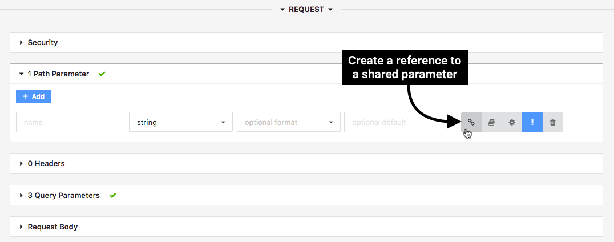
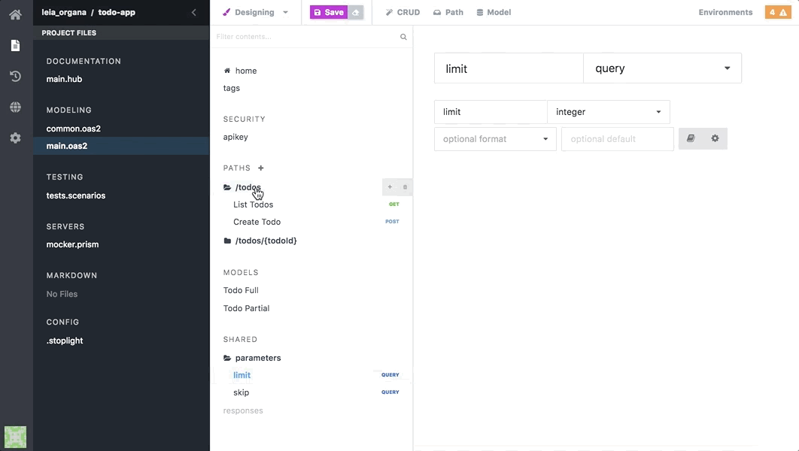
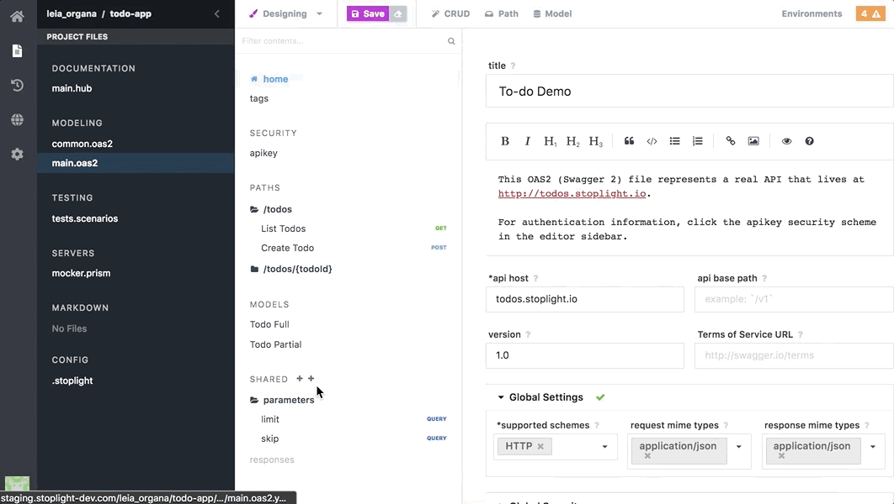
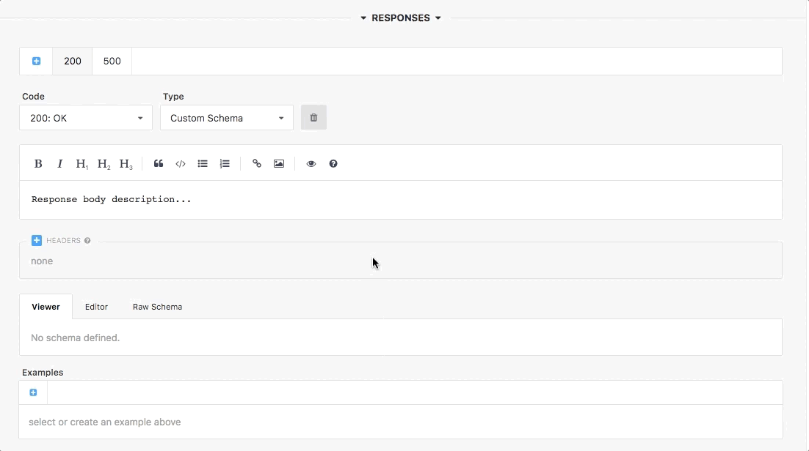

# Shared Parameters and Responses

While designing API's in Stoplight, it is common to have multiple endpoints
share a set of query parameters and API responses. To help reduce extra
work (and the chance of introducing errors), it is important to: 

* Identify endpoints with common parameters 
* Use _shared components_ to reference the same property multiple times instead
  of rewriting the properties for each individual endpoint.

Shared components in Stoplight come in two forms:

* __Parameters__ - These are shared parameters that can be applied to requests
  across multiple endpoints.

* __Responses__ - These are shared response objects that can be applied to
  multiple endpoints.

## Parameters

Shared parameters provide a way to use request properties across multiple API
endpoints without having to duplicate effort.

<<<<<<< HEAD
Shared parameters can be used as the following request properties:

  * __path__ - The request URL _path_
  * __query__ - The request URL query string
  * __header__ - The request HTTP Header field object
  * __body__ - The request HTTP message body
  * __form-data__ - The request HTTP message body in the `multipart/form-data` format 

<!-- theme: info -->
> For more information the above properties, see the OpenAPIv2 Specification
  [here](https://github.com/OAI/OpenAPI-Specification/blob/master/versions/2.0.md#parameter-object)
=======
Shared parameters can be used as the following request properties:

  * __path__ - Specifies that the shared parameter can only be used in an API endpoint as a URL _path_
  * __query__ - Specifies that the shared parameter can only be used in an API
    endpoint as an [URL query
    string](https://en.wikipedia.org/wiki/Query_string)
  * __header__ - Specifies that the shared parameter can only be used in an API
    endpoint as a [HTTP Header field
    object](https://en.wikipedia.org/wiki/List_of_HTTP_header_fields)
  * __body__ - Specifies that the shared parameter can only be used in an API
    endpoint as a [HTTP message
    body](https://en.wikipedia.org/wiki/HTTP_message_body)
  * __form-data__ - Specifies that the shared parameter can only be used in an
    API endpoint as a HTTP body in the
    [`multipart/form-data`](https://developer.mozilla.org/en-US/docs/Web/API/FormData)
    format 
>>>>>>> e6053aba82c6683bbb136fd84a89bd5acddc6ba0

Similar to generic request parameters, restrictions on the parameter values can
also be applied based on type, expected default value, minimum/maximum length,
and regular expression (regex).

To use a shared parameter, navigate to an API endpoint's _Request_ section and
create a reference to the shared parameter using the "chain" button as shown in
the image above. Once the parameter has been referenced, any updates to the
shared parameter will automatically be propagated to every endpoint using that
parameter.

Like other references in Stoplight, shared parameters can also be shared across
files, projects, and other external sources.

## Shared Responses

Shared responses provide a way to re-use response objects across multiple API
<<<<<<< HEAD
endpoints without having to duplicate effort. Similar to shared components
=======
endpoints without having to duplicate effort. Similar to the shared properties
>>>>>>> e6053aba82c6683bbb136fd84a89bd5acddc6ba0
discussed above, shared responses allow you to reference a single response
multiple times without having to recreate each response manually. The added
benefit of this approach is that updates to the shared response object are
automatically propagated to any endpoint using that object, no extra changes
required.

Shared responses allow you to configure the following properties:

* Headers - Customize the HTTP Headers returned in the response
* Response body - Customize the HTTP message body contents using the Stoplight
  modeling tool (or reference a pre-existing model)

<!-- theme: info -->
> For more information the above properties, see the OpenAPIv2 Specification
  [here](https://github.com/OAI/OpenAPI-Specification/blob/master/versions/2.0.md#responseObject)

To use a shared response, navigate to an API endpoint's __Response__ section and
create a reference to the shared response by choosing the _Type_ of the response
as "Reference". Once the Response type is set to "Reference", you can then
choose the shared response to use for that endpoint. Shared responses can also
be shared across files, projects, and other external sources.

***

**Related**

* [OpenAPI v2 Parameter Objects Reference](https://github.com/OAI/OpenAPI-Specification/blob/master/versions/2.0.md#parameter-object)
* [OpenAPI v2 Response Objects Reference](https://github.com/OAI/OpenAPI-Specification/blob/master/versions/2.0.md#responseObject)
